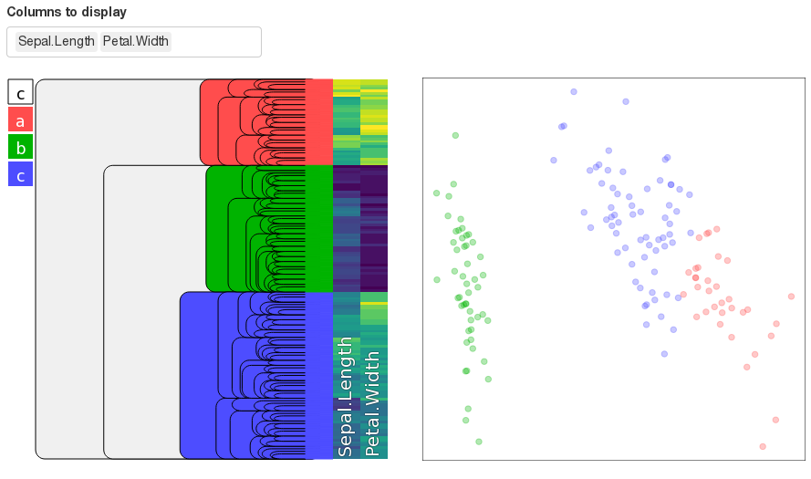

# shinyDendro

This provides idendro-style interactive dendrograms in R Shiny (see https://github.com/tsieger/idendro).

## What does it look like?

You can see an example Shiny dashboard in file `test.R`. You should get
something like this:



## Controls

- keys `a` to `z` and `0` to `9` select a cluster mark
- mouse click assigns the mark to the clicked branch
- `space` sets mark-erasing mode

## Shiny interface

```r
dendrogram <- hclust(...)

ui <- fluidPage(
  titlePanel("shinyDendro test"),
  shinyDendroOutput('SD', width='50em', height='50em')
)

server <- function(input, output) {
  output$SD <- renderShinyDendro({
    shinyDendro(
      'selectedClusters',
      dendrogram$height,
      dendrogram$merge,
      dendrogram$order
    )
  })

  # input$selectedClusters now contains a reactive result with assigned marks.
  #
  # Example:
  # input$selectedClusters == c(' ', ' ', 'a', 'b', 'a', ...)

  # ...
}
```

